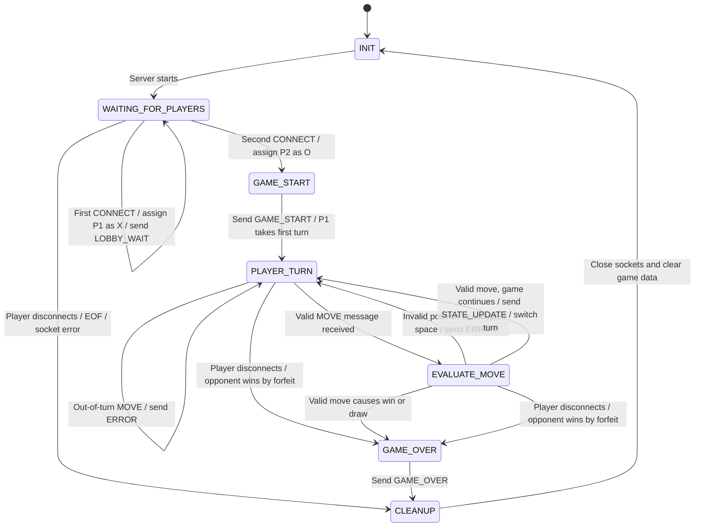

# Tic-Tac-Toe Game State Machine

## Server-Side State Design

I decided to keep the state machine based on what the server is actually doing
instead of making a separate state for every message.

The server uses these states:

- `INIT` - the server is ready but no game has started.
- `WAITING_FOR_PLAYERS` - the server waits until two players have connected.
- `GAME_START` - the server assigns P1/P2, X/O, and creates the empty board.
- `PLAYER_TURN` - the server waits for the current player to send a move.
- `EVALUATE_MOVE` - the server checks whether the requested move is allowed.
- `GAME_OVER` - the match has ended by win, draw, or forfeit.
- `CLEANUP` - sockets and game data are cleaned up before returning to the initial state.

I separated `PLAYER_TURN` and `EVALUATE_MOVE` because receiving a move and
deciding whether it is valid are two different jobs. An invalid move should
return an `ERROR` and go back to the same player's turn instead of changing
the board or crashing the game.

## State Diagram

