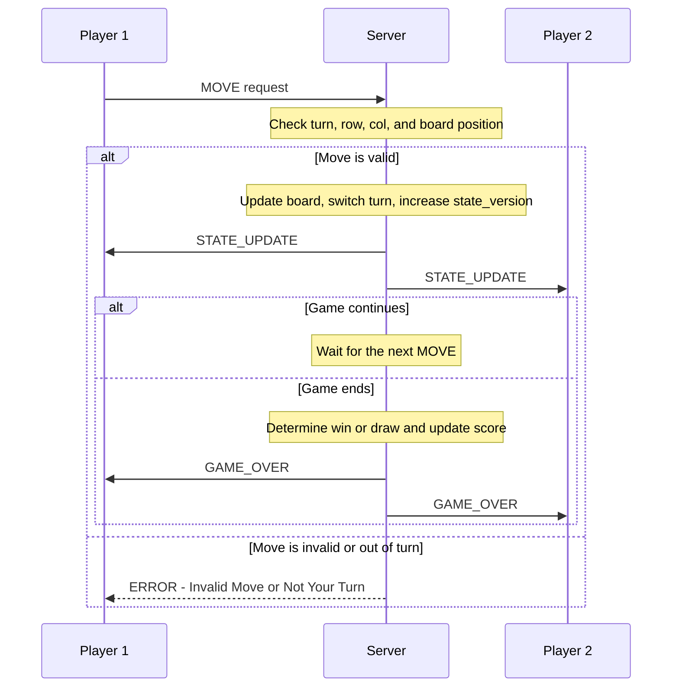

# Tic-Tac-Toe State and Score Broadcast Sequence

## Sequence Diagram

This diagram shows how a player move is handled by the server and how the updated game state is sent to both players.

```mermaid
sequenceDiagram
    participant P1 as Player 1
    participant S as Server
    participant P2 as Player 2
        P1->>S: MOVE request
    Note over S: Check turn, row, col, and board position
        alt Move is valid
        Note over S: Update board, switch turn, increase state_version
        S->>P1: STATE_UPDATE
        S->>P2: STATE_UPDATE
                alt Game continues
            Note over S: Wait for the next MOVE
        else Game ends
            Note over S: Determine win or draw and update score
            S->>P1: GAME_OVER
            S->>P2: GAME_OVER
        end
    else Move is invalid or out of turn
        S-->>P1: ERROR - Invalid Move or Not Your Turn
    end
```